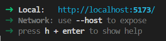

# Jose Alfonzo 17-10012
## Pasos para instalar Three.js 

Nota: Se utilizo un sistema operativo Windows 11 con Node.js instalado

1) Abra la terminal
2) Instalamos Three.js con el siguiente comando:

```npm install --save three```

3) Instalamos Vite en nuestra carpeta TrianguloThreeJs con el siguiente comando:

```npm install --save-dev vite``` 

## Pasos para ejecutar el archivo main.js

1) Abra la terminal
2) Ejecute el siguiente comando:
```npx vite```
3) Presione ctrl + click sobre el url generado donde se le indica el localhost:

